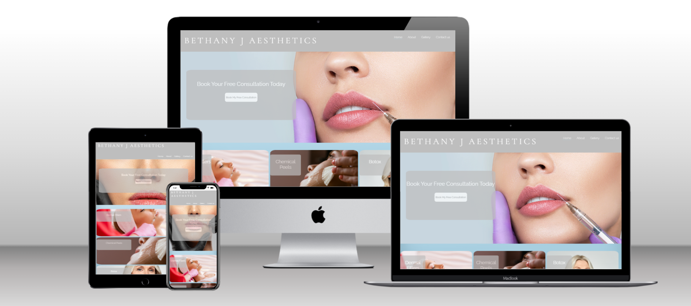
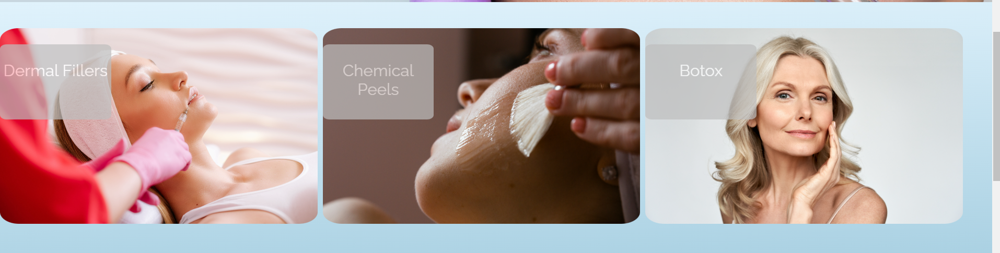

# Bethany J aesthetics

Bethany J Aesthetics is a fully responsive website to advertise beauty services offered by a beauty salon in Cleckheaton, West Yorkshire UK.
Featuring a main home page advertising some of the main treatments available such as chemical peels, botox and lip filler. The Homepage also
features and embeded map and real testimonials. The website also features fully functional "About", "Gallery" and "Contact us" page.

The Website is to target both regular and brand new clients of Bethany J Aesthetics, with features to to gain the confidence of new, potential clients.

## Features

- ### Navigation bar

  - Featured on all three pages, this responsive navigation bar includes links to "Home", "About" "Gallery" and "Contact us" Pages. The navigation bar is featured identically on all 4 pages and allows users to navigate easily through the site.
  - CSS has been used here to make it clear to the user what page they are currently on by underlining the current page with a pale blue colour that ties with the colour scheme.

- ### Landing page image
   - The landing includes a photograph of some attractive lips getting lip filler with a text overlay to allow the user to see straight away where they can book a free consultation.
   - The attractive photo gives the user an insite on the type of look they might want to achive.

- ### Treatment Section- Section 2
  - Section 2 includes 3 side by side divs containing 3 different treatments available.
  - each div contains photos with the matching treatments names on top to give the user an instant insite to the different treatments available.
  - The photos displayed also give the user an insite into what getting the treatment done might look like and the results they could acheive.

  

### Map and Review Section- Section 3 
- Section 3 includes 2 side by side divs, the 1st displaying an interactive map with a "where to find us" heading, and a reviews div with the "Google 5 star review logo" at the top and 3 individul reviews from google inside a grey box.
- The interactive map is an excellent way to instantly make users aware of the area/location the salon is located in. 
- The reviews section is an extremely good way to instsantly build confidence and the "Google 5 star review logo" will reasure potential clients that might be visiting the site for the first time. 

  
