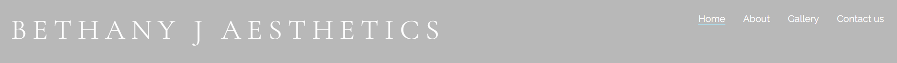
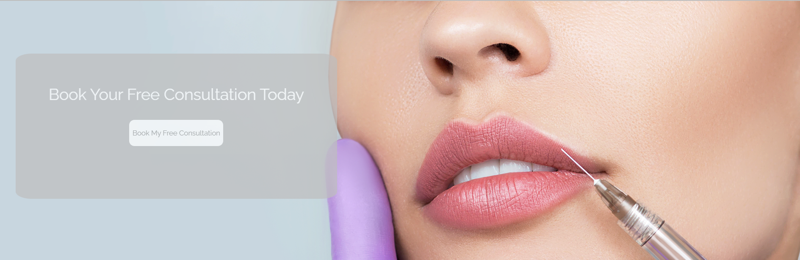
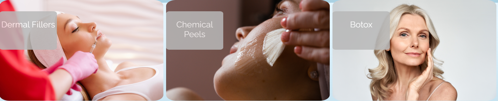

# Bethany J aesthetics

Bethany J Aesthetics is a fully responsive website to advertise beauty services offered by a beauty salon in Cleckheaton, West Yorkshire UK.
Featuring a main home page advertising some of the main treatments available such as chemical peels, botox and lip filler. The Homepage also
features and embeded map and real testimonials. The website also features fully functional "About", "Gallery" and "Contact us" page.

The Website is to target both regular and brand new clients of Bethany J Aesthetics, with features to to gain the confidence of new, potential clients.

## Features

- ### Navigation bar

  - Featured on all three pages, this responsive navigation bar includes links to "Home", "About" "Gallery" and "Contact us" Pages. The navigation bar is featured identically on all 4 pages and allows users to navigate easily through the site.
  - CSS has been used here to make it clear to the user what page they are currently on by underlining the current page with a pale blue colour that ties with the colour scheme.

- ### Landing page image
   - The landing includes a photograph of some attractive lips getting lip filler with a text overlay to allow the user to see straight away where they can book a free consultation.
   - The attractive photo gives the user an insite on the type of look they might want to achive.

- ### Treatment Section- Section 2
  - Section 2 includes 3 side by side divs containing 3 different treatments available.
  - each div contains photos with the matching treatments names on top to give the user an instant insite to the different treatments available.
  - The photos displayed also give the user an insite into what getting the treatment done might look like and the results they could acheive.

  

- ### Map and Review Section- Section 3 
  - Section 3 includes 2 side by side divs, the 1st displaying an interactive map with a "where to find us" heading, and a reviews div with the "Google 5 star review logo" at the top and 3 individul reviews from google inside a grey box.
  - The interactive map is an excellent way to instantly make users aware of the area/location the salon is located in. 
  - The reviews section is an extremely good way to instsantly build confidence and the "Google 5 star review logo" will reasure potential clients that might be visiting the site for the first time. 

- ### The Footer
   - The footer contains all social media links  with matching icons to encourrage users to follow them and stay up to date.
   - A smaller logo is also located in the bottom left of the footer that when clicked will take the user back to the hopepage incase the user might get lost.

   

- ### About page 
  - The about page is intended to really connect with customers and to reasure them of their ethos and goals.
  - The Photo of the treatment room in the top left is to show the users what to expect when they go het their treatment done and familiarise them with the setting.

  

- ### Gallery page
  - The gallery page shows real photos of clients both before and after and just after photos, giving potential clients realistic ideas of what they can achieve 
  - Photos of both men and women are included to reasure customers that Bethany J Aesthetics is unisex.

  

- ### Contact us page
   - This page includes 2 main divs, the first being a form div allowing potential and interested clients to send through an detailed enquiry (with a large text box to allow clients to write a detailed enquiry including any past cosmetic procedures and what they're trying to achive).
    - The right div contains the company phone number, email address and location with matching font awesome icons to make it clear to the user what the information means. 

   

- ### Future features
  - On the Contact us page i would like to feature a live booking system with a calender and all of the available times/ dates for a free consultation, making it even easier for users to book an instant appointment.

## Testing 

- To test my website, i performed the following steps: 

  - Manually checking all the features of the website to ensure they work as intended. This includes testing all links, forms, images and all other interactive elements on the website.
  - Testing the website on different web browsers such as Chrome, Firefox, Safari, and Edge to ensure that the website works well on all of them.
  - Testing the website on different mobile devices such as smartphones and tablets to ensure that it is responsive and adjusts well to different screen sizes.
  - Testing the website to ensure that it is accessible to people with disabilities. This includes testing the website with screen readers, keyboard-only navigation, and other accessibility tools.
  
  

  
   By performing these tests, I can ensure that a website works well and provides a good user experience to its visitors.

- ### Validator Testing
  - HTML 
    Passed the official W3C validator with no errors. 
  - CSS
   Passed through the official (Jigsaw) validator with no errors.

   

 