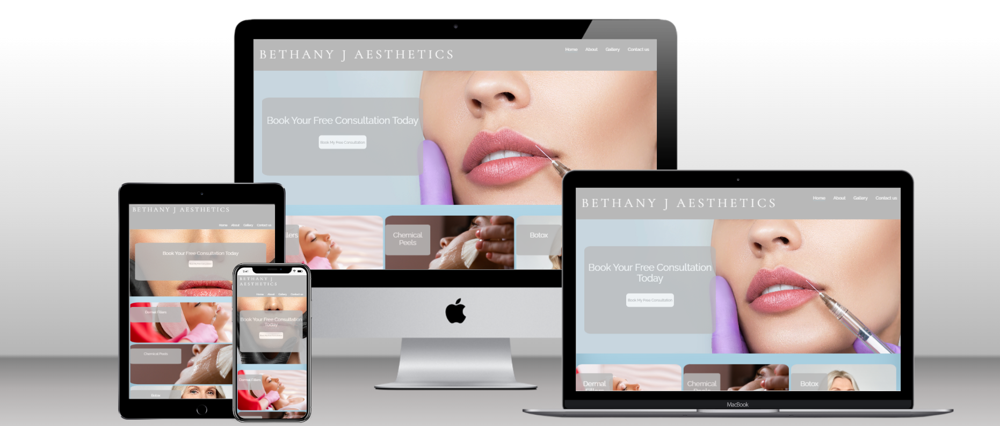
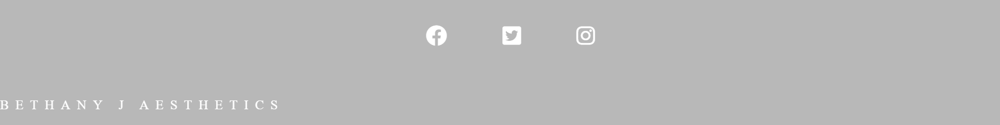

# Bethany J Aesthetics

Bethany J Aesthetics is a fully responsive website to advertise beauty services offered by a beauty salon in Cleckheaton, West Yorkshire UK. Featuring 4 main pages, A "Home" page an "About", "Gallery" and a "Contact Us" page.

The Website is to target both regular and brand new clients of Bethany J Aesthetics, with features to gain the confidence of new, potential clients.

## Colour Scheme

- Myself and the client worked together to come up with a colour scheme that would be modern, easy to read, and tasteful.
- The main colour used on the header, footer, and divs is a cool, light grey colour, I then used a pale blue gradient background to add a small amount of colour that tied in with the header and footer colour.
- Using a similar pale blue I created a hover Pseudo selector to draw attention to the nav links and buttons, then using the same colour I created an active class to underline the page in the nav bar that the user is currently on.

## Features

- ### Navigation bar

  - Featured on all three pages, this responsive navigation bar includes links to the "Home", "About" "Gallery" and "Contact Us" Pages. The navigation bar is featured identically on all 4 pages and allows users to navigate easily through the site.
  - CSS has been used here to make it clear to the user what page they are currently on by underlining the current page with a pale blue colour that ties in with the colour scheme.

- ### Landing page image
  - The landing includes a photograph of some attractive lips getting lip filler with a text overlay to allow the user to see straight away where they can book a free consultation.
  - The attractive photo gives the user an insight into the type of look they might want to achieve.

- ### Treatment Section- Section 2

  - Section 2 includes 3 side-by-side divs containing 3 different treatments available.
  - Each div contains photos with the names of the matching treatment on top to give the user an instant insight into the different treatments available.
  - The photos displayed also give the user an insight into what getting the treatment done might look like and the results they could achieve.
    

- ### Map and Review Section- Section 3
  - Section 3 includes 2 side by side divs, the 1st displaying an interactive map with a "where to find us" heading, a reviews div with the "Google 5-star review logo" at the top, and 3 individual reviews from Google inside a grey box.
  - The interactive map is an excellent way to instantly make users aware of the area/location the salon is located in.
  - The reviews section is an extremely good way to instantly build confidence and the "Google 5-star review logo" will reassure potential clients that might be visiting the site for the first time.

- ### The Footer

  - The footer contains all social media links with matching icons to encourage users to follow them and stay up to date.
  - A smaller logo is also located in the bottom left of the footer that when clicked will take the user back to the homepage in case the user might get lost.

  

- ### About page

  - The About page is intended to really connect with customers and to reassure them of their ethos and goals.
  - The Photo of the treatment room in the top left is to show the users what to expect when they go get their treatment done and familiarises them with the setting.
  - The Youtube short, embeded in the bottom right of the page gives users a virtual tour of the salon, this gives users an insite of what to expect when going to get a treatment done.

  

- ### Gallery page

  - The gallery page shows real photos of clients both before and after and just after photos, giving potential clients realistic ideas of what they can achieve
  - Photos of both men and women are included to reassure customers that Bethany J Aesthetics is unisex
    

- ### Contact us page

  - This page includes 2 main divs, the first being a form div allowing potential and interested clients to send through a detailed inquiry (with a large text box to allow clients to write a detailed inquiry including any past cosmetic procedures and what they're trying to achieve).
  - The right div contains the company phone number, email address, and location with matching font awesome icons to make it clear to the user what the information means.

  

- ### Future features
  - On the Contact Us page, I would like to feature a live booking system with a calendar and all of the available times/ dates for a free consultation, making it even easier for users to book an instant appointment

## Testing

- To test my website, I performed the following steps:
   - Manually checking all the features of the website to ensure they work as intended. This includes testing all links, forms, images, and all other interactive elements on the website.
   - Testing the website on different web browsers such as Chrome, Firefox, Safari, and Edge to ensure that the website works well on all of them.
   - Testing the website on different mobile devices such as smartphones and tablets to ensure that it is responsive and adjusts well to different screen sizes.
   - Testing the website to ensure that it is accessible to people with disabilities. This includes testing the website with screen readers, keyboard-only navigation, and other accessibility tools.

  

  By performing these tests, I can ensure that a website works well and provides a good user experience to its visitors.

- ### Validator Testing

   - HTML 
     - Passed the official W3C validator with no errors.
   - CSS
    - Passed through the official (Jigsaw) validator with no errors.

- ### Unfixed Bugs
  - No unfixed bugs.

## Deployment

- ### The site was deployed using GitHub pages using following steps:
 - In the bethany-j-aesthetics repository, go to the Settings tab.
 - In the source section menu, select the Master Branch,
 - When the master branch has been selected, the page will refresh and come up with a notification telling you the deployment has been successful.
   You can find the link for bethany-j-aesthetics here - https://eleanorcundall.github.io/bethany-j-aesthetics/

## Credits

- ### Content

  - Fonts used are from Google fonts
  - Gradient background taken from SheCodes coding tools.
  - I used the website Stack Overflow for help and advice throughout the project.
  - I used the love running project code to create the social media logos in the footer
  - font awesome was used for icons.

- ### Media
  - All of the photos used on the home page and some of them on the Gallery page were used using Shutter Shock (a stock image site).
  - The other images in the Gallery were sourced and used with consent from real Bethany J Aesthetics clients.
  - The photo on the About page is a real photo of the Bethany J Aesthetics treatment room, taken by the owner and founder.
